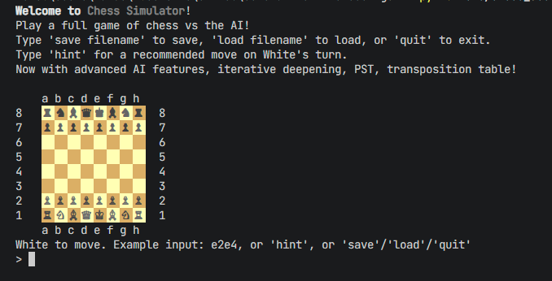
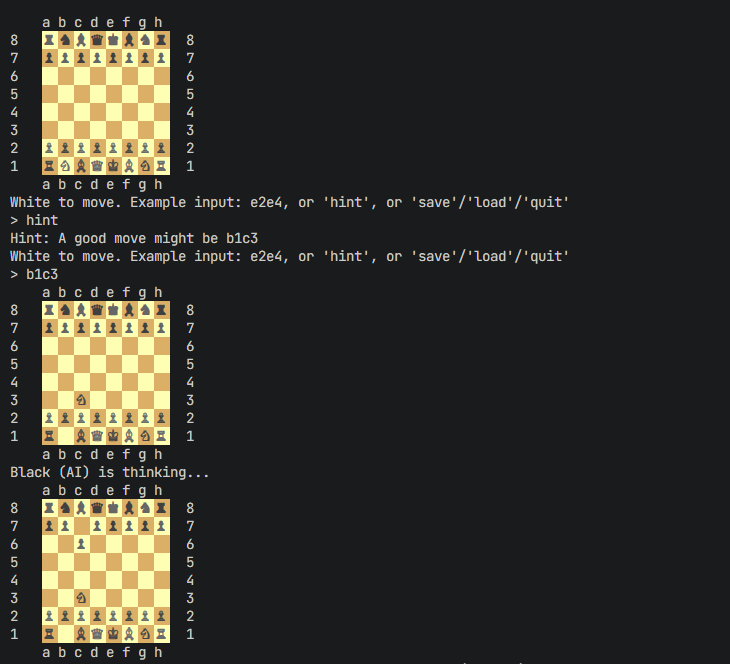
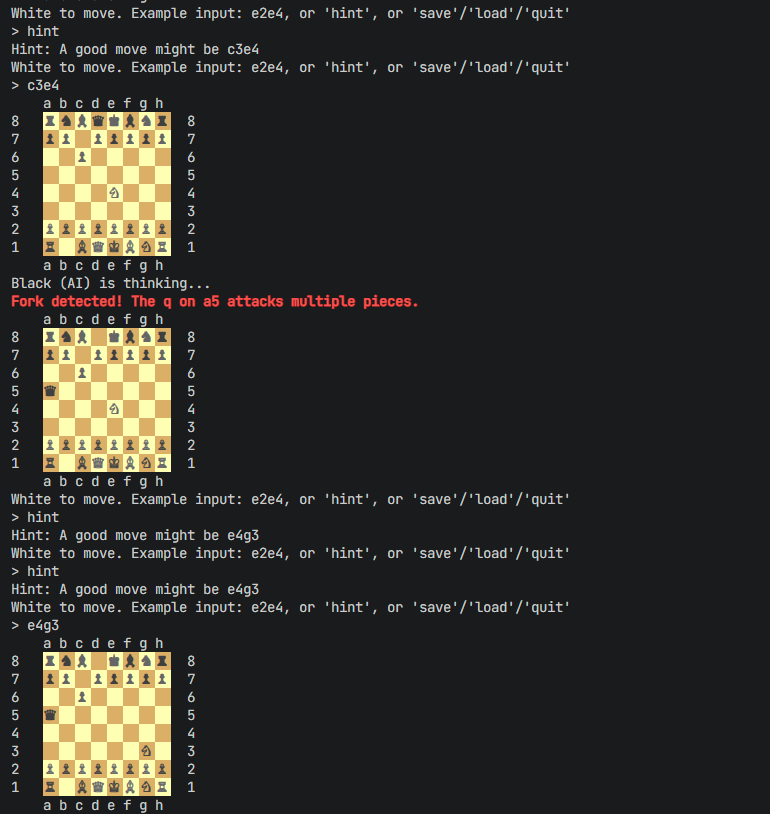
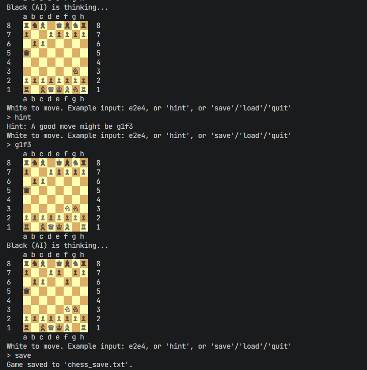

# Generative AI Chess Assistant

A terminal-based chess assistant written in Python. The project lets a human play as White against an AI-controlled Black side, while the assistant evaluates board states, searches possible continuations, recommends moves, and manages full chess game flow from the command line.

## Features

- Play a full chess game against an AI opponent.
- Enter moves in coordinate notation such as `e2e4`.
- Ask for a move recommendation with the `hint` command.
- Uses iterative deepening search for AI decision-making.
- Evaluates positions with material values and piece-square tables.
- Uses alpha-beta pruning and a transposition table to reduce search cost.
- Supports legal move filtering, check, checkmate, and stalemate detection.
- Handles castling, en passant, pawn promotion, and the 50-move rule.
- Tracks threefold repetition.
- Saves and loads games through FEN plus move history.
- Renders a colored chessboard directly in the terminal.

## Commands During Play

| Command | Purpose |
| --- | --- |
| `e2e4` | Move a piece using coordinate notation |
| `hint` | Ask the assistant for a recommended move |
| `save filename` | Save the current game state |
| `load filename` | Load a saved game state |
| `quit` | Exit the game |

## AI Engine

| Component | Role |
| --- | --- |
| Move generation | Produces pseudo-legal moves for each piece |
| Legal filtering | Removes moves that leave the king in check |
| Evaluation | Scores board states with material and positional heuristics |
| Iterative deepening | Searches progressively deeper move trees |
| Alpha-beta pruning | Skips branches that cannot improve the result |
| Transposition table | Reuses previously evaluated positions |
| Tactical detection | Reports notable tactical patterns after moves |

## Screenshots

### Welcome Screen



### Gameplay







## Tech Stack

| Part | Tech |
| --- | --- |
| Language | Python |
| Interface | Terminal |
| AI Search | Iterative deepening, alpha-beta pruning |
| Position Scoring | Material evaluation, piece-square tables |
| Persistence | FEN and move-history text files |
| Dependencies | Python standard library |

## Project Structure

```text
.
|-- src/
|   `-- chess_assistant.py        # Chess rules, AI search, terminal gameplay
|-- assets/                       # README screenshots
|-- examples/
|   `-- sample_gameplay.txt       # Example saved game state
|-- requirements.txt              # Standard-library dependency note
|-- .gitignore                    # Local cache and save-file exclusions
`-- README.md
```

## Run Locally

Check Python:

```bash
python --version
```

Run the assistant:

```bash
python src/chess_assistant.py
```

Optional virtual environment:

```bash
python -m venv .venv
```

Windows:

```bash
.venv\Scripts\activate
```

macOS/Linux:

```bash
source .venv/bin/activate
```

There are no external Python packages required. The assistant runs on the Python standard library.

Optional check:

```bash
pip install -r requirements.txt
```

## Example

```text
White to move. Example input: e2e4, or 'hint', or 'save'/'load'/'quit'
> e2e4
Black (AI) is thinking...
```

The assistant keeps the board state, validates the move, lets the AI respond, and continues until checkmate, stalemate, draw, or user exit.

## Saved Games

Games are saved as text files containing:

- a FEN board state
- side to move
- castling rights
- en passant square
- halfmove and fullmove counters
- move history

See [examples/sample_gameplay.txt](examples/sample_gameplay.txt) for a sample save format.
